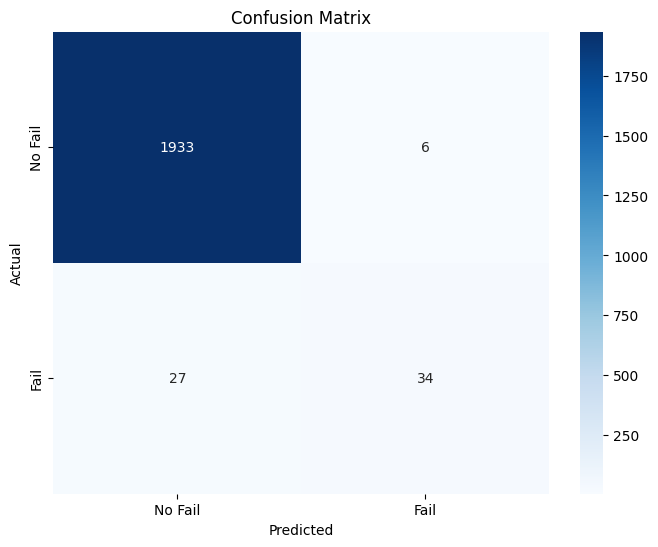
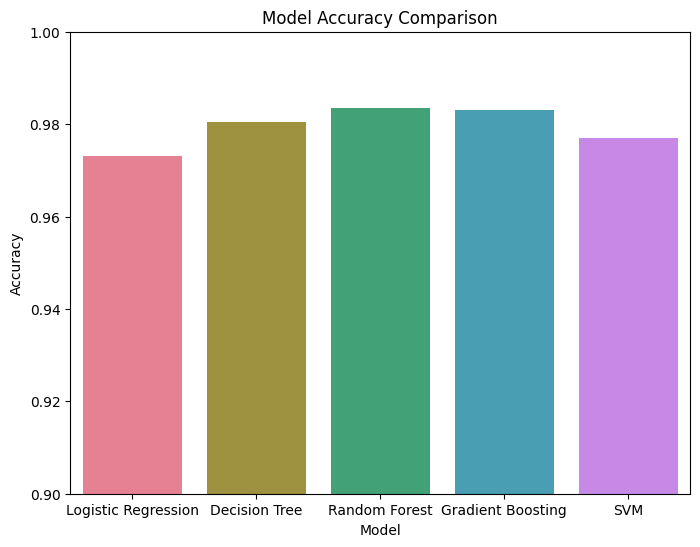

# Machine Failure Prediction

This project predicts machine failures from sensor data using machine learning models.

**Live Demo:** https://machine-failure-prediction-leluke007.streamlit.app

## Features

- Data processing and visualization (Jupyter Notebook)
- Multiple machine learning models compared
- Random Forest model deployed for prediction
- Streamlit web app for predictions

## Dataset

Dataset used: https://www.kaggle.com/datasets/shashanknecrothapa/machine-failure-predictions

The dataset contains records of machine operations and failures. Each row represents a machine at a specific time, with the following columns:
- **UDI**: Unique identifier for each record
- **Product ID**: Unique identifier for each product
- **Type**: Machine type (H, L, M)
- **Air temperature [K]**: Air temperature in Kelvin
- **Process temperature [K]**: Process temperature in Kelvin
- **Rotational speed [rpm]**: Rotational speed in revolutions per minute
- **Torque [Nm]**: Torque in Newton-meters
- **Tool wear [min]**: Tool wear in minutes
- **Machine failure**: Target variable, indicates if any failure occurred (binary)
- **TWF**: Tool wear failure (binary)
- **HDF**: Heat dissipation failure (binary)
- **PWF**: Power failure (binary)
- **OSF**: Overstrain failure (binary)
- **RNF**: Random failure (binary)

## Setup

1. **Clone the repository**  
   ```bash
   git clone https://github.com/LeLuke007/Machine-Failure-Prediction.git
   ```
   ```bash
   cd Machine-Failure-Prediction
   ```

2. **Install dependencies**  
   ```bash
   pip install -r requirements.txt
   ```

3. **Run the Streamlit app**  
   ```bash
   streamlit run app.py
   ```

## Usage

- Open the web app
- Enter sensor parameters (Type, Air Temperature, Process Temperature, Rotational Speed, Torque, Tool Wear)
- Click "Predict" to see if the machine is likely to fail

## Model Details

- **Features Used:**  
  - Type (H, L, M)
  - Air temperature [K]
  - Process temperature [K]
  - Rotational speed [rpm]
  - Torque [Nm]
  - Tool wear [min]

- **Models Compared:**  
  - Logistic Regression
  - Decision Tree
  - Random Forest (deployed)
  - Gradient Boosting
  - Support Vector Machine

## Results

**Validation Accuracy:**
  - **Logistic Regression:** 0.973
  - **Decision Tree:** 0.9805
  - **Random Forest:** 0.9835
  - **Gradient Boosting:** 0.983
  - **Support Vector Machine:** 0.977

<br>
<div align="center">
<table>
<tr>
    <td align="center"><b>Confusion Matrix for Random Forrest</b></td>
    <td align="center"><b>Model Accuracy Comparison</b></td>
</tr>
<tr>
    <td></td>
    <td></td>
</tr>
</table>
</div>